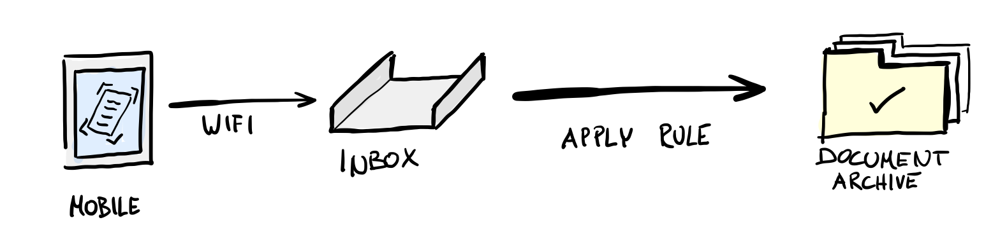

# 🗄 filer

> A web application to make filing scanned PDF documents simpler.

## Use Case

We use a scanning app on our smartphones to scan documents to an inbox on a local file server at home. The `filer` web application shows an inbox document and provides a set of pre-configured rules to categorize it. Selecting a rule moves the document to its final destination in the document archive directory structure and the next inbox document is displayed.



### Features

- Preview PDF document from an inbox directory
- Move inbox document, based on a set of configurable rules, to another directory
- Rename inbox document before moving it to the document archive
- Delete inbox document without moving

### The Story aka "Why!?"

We went paperless some years ago at home and made scanning receipts and other documents a habit. To make the scanning as effortless as possible, we decided to upload the resulting PDF files automatically to a shared inbox directory on our file server. Unfortunately, filing and categorizing the scans afterwards turned out to be too cumbersome to do regularly: Sitting down and moving files from one folder to another was just nothing we enjoy that much 😇

`filer` makes this task less tedious for us: Open the web application, have a glance on the PDF preview, select one of the preset actions, repeat until the inbox is empty.

## Usage

1. Create a `rules.yml` file with your categorization rules of choice (see "Rules" Section below).

2. Prepare an inbox and document archive directory

3. Start a `filer` Docker container:

   ```bash
   docker run -it --rm \
     -v /your/inbox:/inbox \
     -v /your/archive:/data \
     -v /your/rules.yml:/rules.yml \
     -p 8000:8000 \
     ghcr.io/swissmanu/filer/filer:latest
   ```

4. Access `filer` via https://localhost:8000

## Configuration

### Rules

```yaml
rules:
  # Moves a document from the inbox to "FILER_DATA_PATH/Receipts":
  - name: "Receipts"
  	description: "Receipts and bills"
    actions:
      - type: "move"
        target: "Receipts"
  # Moves a document from the inbox to "FILER_DATA_PATH/Insurances/Health":
  - name: "Health Insurance"
  	description: "All documents related to our health insurance"
    actions:
      - type: "move"
        target: "Insurances/Health"
```

### Environment Variables

| Environment Variable | Default       | Description                                                                                                                  |
| -------------------- | ------------- | ---------------------------------------------------------------------------------------------------------------------------- |
| `FILER_ADDR`         | `:8000`       | A network interface and port where filer will provide its API and UI via HTTP.                                               |
| `FILER_INBOX_PATH`   | `./inbox`     | Path to the inbox directory.                                                                                                 |
| `FILER_DATA_PATH`    | `./data`      | Path to the data directory. Rule target paths are always evaluated relative to the data path.                                |
| `FILER_RULES_PATH`   | `./rules.yml` | Path to a YAML file containing rule definitions.                                                                             |
| `FILER_UI_PATH`      | `./ui`        | Path to filers web user interface. This variable is useful during development; you can ignore it in productive environments. |
| `UMASK_SET`          | `-022`        | Set the `umask` value for files created by the filer application.                                                            |

## Development

### Start development

```shell
make install      # Instal dependencies
make start-ui     # Start rollup in watch mode
make start-server # Start http server
```
